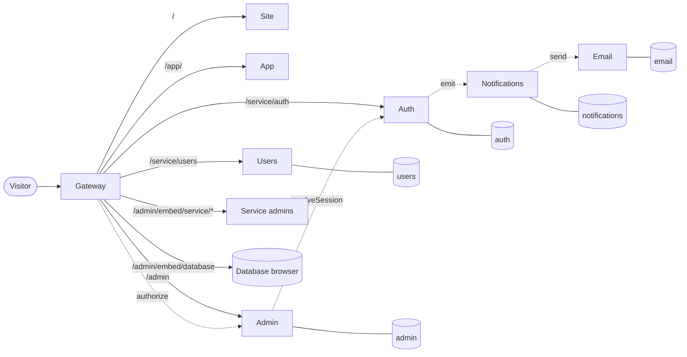

*[Documentation](README.md) → Architecture*

# Architecture

Seven services behind one door, each owning its own data and its own interface, plus the database
browser the admin panel embeds.

## The shape of it

Solid lines are requests from outside; dotted lines are calls services make to each other over the
internal network, which nothing outside can reach.

## Why it is split this way

Each service owns one thing completely, including its database. Nothing reads another service's
tables — a service that did would break the moment the other changed a column, and there would be no
way to replace one of them without replacing both.

| Service | Owns | Deliberately does not know |
| --- | --- | --- |
| **gateway** | The public surface: routing, allowlists, the admin decision | Any business rule |
| **site** | Public pages | Anything about a signed-in person |
| **app** | The interface behind sign-in | Any data; it asks Auth and Users |
| **auth** | Identity, passwords, sessions, security events | Who is an administrator; product data |
| **users** | The product profile | Passwords, sessions, admin rights |
| **admin** | Who may open the panel and what they may reach | How anyone signs in |
| **notifications** | Typed events and where they go | How a message is written or sent |
| **email** | Templates, publishing, transports, the delivery log | Why a message was asked for |

The two that are easiest to confuse are Auth and Users. An identity is *how someone signs in*; a
profile is *who they are inside the product*. Keeping them apart is what lets a product change its
profile fields freely without touching anything that guards an account.

Admin is a third thing again: being an administrator is not a property of an identity, it is a
separate record. That is why deleting an administrator entry never touches the account.

## One way in

Gateway is the only container published outside — locally by a single port, in production by the
platform routing a domain to it. Everything else lives on the internal network with no host port at
all, including the database browser.

Gateway decides three things and nothing else:

1. **Is this path public?** An explicit allowlist. A service not on it answers 404 from outside, no
   matter what it exposes internally.
2. **Which part of the panel is this, and may this person open it?** Gateway works out the target
   from the URL — the panel, one service's admin, or the database area — and asks Admin, every time,
   caching nothing. That is why a revoked grant takes effect on the very next request, and why
   Gateway holds no policy: it knows the shape of the URLs, not who is allowed.
3. **What does the service behind it get to know?** Gateway builds the `x-template-admin-*` headers
   itself after that decision, and strips whatever arrived with the request. A client cannot forge
   an administrator.

If Admin or Auth cannot be reached, the answer is a 503, not a guess. A gateway that failed open
would be worse than one that was down.

## The admin panel is composed, not merged

The central shell owns the sidebar, the theme and the URL. Each service admin is a separate build,
owned by its service, embedded as a same-origin iframe; the shell never imports their code. Hiding
a service in the sidebar is presentation, never protection — the embedded URL passes the same
Gateway check.

See [the admin panel](admin-panel.md) for what it contains, how the two sides talk, and how to add
to it.

## Contracts, not conventions

Services talk over oRPC contracts with Zod schemas, kept in `contracts/`. A contract is the only
thing two services share; neither imports the other's code, and `scripts/check-boundaries.mjs`
refuses a build where one does — type-only imports included.

Each contract is split by who may call it:

- **public** — reachable through Gateway by anyone, session or not;
- **internal** — the Docker network only, for service-to-service calls;
- **admin** — through Gateway's admin route, after the role and grant were checked.

Notifications and Email have no public surface at all.

## Data

One PostgreSQL server, one database per stateful service, named `<PROJECT_SLUG>_<service>`. Each
service applies its own versioned migrations on start; nothing migrates another's schema.

In production the server is a managed resource of the deployment platform, reached through
`DATABASE_URL`. Locally it is a container in the same Compose project, so the whole thing has one
lifecycle.

## Further reading

- [The admin panel](admin-panel.md) — what it contains and how it is composed.
- [Administrator access](admin-access.md) — roles, grants and the first owner.
- [Local development](local-development.md) — running it, worktrees, checks.
- [Deployment](deployment.md) — what a deployment supplies and what it must not.
